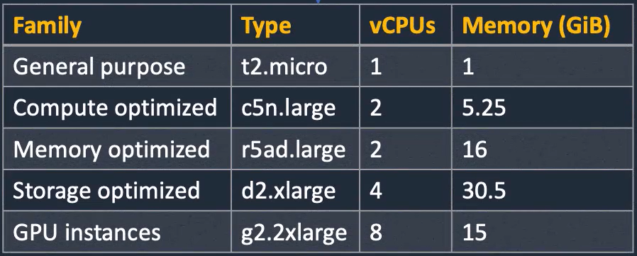
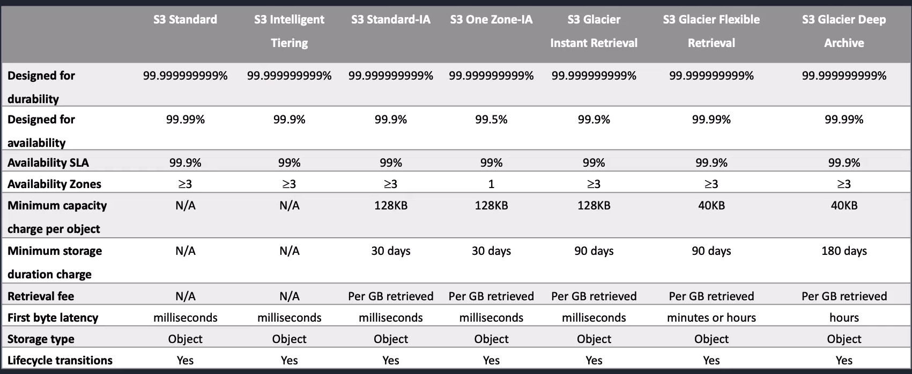

## Task 2: AWS Compute & Storage Services

### Launch an EC2 instance:
- Select an instance type

- Instance t2.micro is used for general purposes 
- Select Amazon Machine Image (AMI) based on operating system 
- Create custom AMI to launch
- To Launch EC2 Instance:
    1. Search for EC2 on Console -> Dashboard
    2. Launch Instance
    3. Select AMI based on operating system and select instance type as t2.micro
    4. Create key pair to securely connect to instance - add key pair name, can use default key setting 
    5. Key pair will be downloaded on your device with private and public key - Move it to a folder from downloads
    6. Network Setting - Edit Security group name and description, select exisiting security group, select WebAcess as common security group
- Terminate instance to delete when you are done to stop all charges
- Stop instanse - will stop taking charges from running compute and memory but will still pay for storage allocated to the server

### Connect to EC2:
- Click Connect with EC2 instance selected
- Check SSH Client if you want to connect from your home computer - Use private key file in the example command
- Can use RDP Client to connect instance on Windows
- Use Public DNS as computer and Username for Remote Desktop Client connection
- Click Get password - upload key pair file and decrypt password 
- Open Remote Desktop Connection application: 
    1. Use Public DNS as computer
    2. Enter Username and password decrypted
- Connected to desktop of a windows server on AWS 

## User Data:
- User data is the code that runs when instance starts for first time
- Can install web service on EC2 instance
- Has limited user data
- Can run batch and powershell scripts on windows

## Metadata:
- Metadata is information about the EC2 instance
- Can find the metadata by running this on command window: curl http://169.254.169.254/latest/meta-data
- Can add to url to get specific info about the EC2 instance

### Practise User Data:
Launch Instance with User Data
1. Launch EC2 instance with -
    - AMI - Amazon Linux
    - Instance type = t2.micro
    - Proceed without key pair
    - Network settings - Select existing security group and select WebAccess as common security groups
    - Under Advanced details, Scroll to User data and Paste/upload user data script(#!/bin/bash.....EOF) in user-data-metadata.md file 
2. Copy Public IPv4 address and search the address on a browser. View web page made using user data and meta data 

### Practice Metadata:
1. Launch EC2 instance with -
    - AMI - Amazon Linux
    - Instance type = t2.micro
    - Proceed without key pair
    - Network settings - Select existing security group and select WebAccess as common security groups
    - Under Advanced details, Scroll to Metadata and Keep Metadata accessible as enabled. Change Metadata version to V1 and V2 (token optional) if you don't want to use token
    - Don't change Metadata version in advanced details section if you want to use token aunthentication.
2. Connect Instance using EC2 Instance Connect
3. To run Commands for EC2 Instance with V1 and  V2 (token optional) as Metadata version:
    - Run commands for IMDS v1 in user-data-metadata.md file 
    - Can retrieve information about EC2 instance 
    - To get all information options, Run: curl http://169.254.169.254/latest/meta-data/ 
4. To run commands EC2 Instance with V2 (token required) as Metadata version:
    - Follow steps for IMDS v2 in user-data-metadata.md file
    - Have to create session and get token as commands will not work without token
    - To get token, Run: echo $TOKEN  

### Explore IAM roles with EC2:
How to give an Instance permissions:- 
1. Using Access keys (Normally avoided): 
    - AWS CLI is configured with access keys
    - Access key is associated with an IAM user and the key will user permissions assigned to the user
    - Commands run on an instance will have same permissions as the user would have
    - This method is Normally avoided since using access keys is a major security risk
2. Using IAM Roles (More secure):-
    - Roles have policies assigned to them
    - Instance will have same permissions as the IAM role 
    - Credentials are not stored on instance - More secure

### Practice Access keys with EC2 (NOT Reccommended):
1. Search for IAM on Console, Go to IAM Users Section -> Select an IAM user to assign role -> Go to Security Credentials -> Create Access key -> Choose Command line interface as use case -> Create access key
2. Copy access key
3. Launch an instance
4. Connect Instance using EC2 Instance Connect -> Open server
5. Run command: aws configure
6. Enter access key id, secret access key and default region name(eg:us-east-1)  
7. To access S3 bucket with permission through access key , Run command: aws s3 ls
8. To make a bucket to store data , Run command: aws s3 mb s3://mybucket-(insert random characters to make bucket unique). Eg: bucket name as 'mybucket-2e2hsa'
9. Remove access key credentials stored in server by:
    - Run command: rm -rf ~/.aws/*
10. Deactivate access key and then delete the key under IAM user section

### Practice IAM roles with EC2 (Reccommended - Better Method to give permissions to Instance):
1. Search for IAM on Console, Go to IAM Roles Section -> Create Role -> Choose AWS service and EC2
as use case -> Add permissions (eg:s3readonlyaccess) -> Add role name -> Create Role button
2. Lauch/Select an Instance to give permission, Click Actions -> Secuirty -> Modify IAM Role -> Choose IAM Role
3. Connect Instance using EC2 Instance Connect -> Open server
4. Now Instance has permissions provided without any credentials 
5. Can access S3 bucket with permission through access key , Run command: aws s3 ls
6. Can make a bucket to store data , Run command: aws s3 mb s3://mybucket-(insert random characters to make bucket unique). Eg: bucket name as 'mybucket-2e2hsa'

### Launch Docker Containers on AWS Fargate:
- Docker containers can be run on AWS using Amazon Elastic Container Service (ECS)
- ECS cluster - groups tasks that run docker container
- Can use serverless with AWS Fargate as it manages for you and you don't need to manage EC2 containes instances yourself but limited control
- Serice under clusters is where you can add load balances, aut-scaling
- Only running tasks costs money
- How to Launch Docker Container on AWS Fargate:
    1. Search for Amazon Elastic Container Service on Console -> Clusters 
    2. Create Cluster with a name and chose AWS Fargate
    3. Click 'View in Cloud Formation' and reload till cluster creation is completed
    4. Go to Clusters -> Select the cluster -> Must create cluster servive to define number of tasks to run but should first create task definitions
    5. Go to Task definitions -> Create a new task with:- 
        - Add task name
        - Launch type as AWS Fargate, use default settings, CPU = 1vCPU, Memory = 3GB
        - Specify Task role to allow container to make API requests or other services
        - For practice, leave task role empty
        - Keep Task execution role as create new role    
        - Add details for essential container:-
            - Add contianer name
            - Image url as (container name):latest 
            - Use log collection
        - Create task
    6. Can Run task: Go to Clusters -> Select the cluster -> Click Tasks -> Run new task with default setting, choose task family as task definition name in deployment configuration and choose security group as 'webacess' under networking -> Create task to start running task. (Can stop selected task to delete)
    7. Can Run service: Go to Clusters -> Select the cluster -> Click Services -> Create service to specify np.of instances/tasks to run -> Keep capacity provider as fargate, application type as service, choose task definition family as task definition name, add service name, add no.of desired tasks and choose security group as 'webacess' under networking -> Create service (Can delete servicewith force delete and cluster should be deleted seperately)

### Storage Comparison Notes:
The services used are Amazon Elastic Block store, Amazon Elastic File system and Amazon Simple Storage System(S3) and Amazon Storage Gateway. We can connect the EC2 instance to any of storage type using the services.
Types of AWS Storage systems are:-
1. Block-based -
    - Examples are Hard disk drives(HDD) and solid state drives (SSD)
    - Using HDD in the cloud is very cost effective
    - HDD are magnetic devices that are slower than SSD
    - SSD uses flash memory. It is faster than HDD but costlier
    - Computers use HDD and the HDD can be partitioned with the volume
    - Disks can be internal or network attached 

2. File-based -
    - File system is created on top of block based system
    - It is shared across the network using Network Attached Storage Server (NAS)
    - Connection with Remote drive is maintained with NAS and client  
    - Can be shared by many users

3. Object-based -
    - Storage container called bucket on AWS S3
    - User uploads objects using web browser using REST API
    - Objects are files stored in a container (can be files, videos, pdfs, pics etc.)
    - Scalable and low costs 
    - Can mimic hierarchy with prefixes
    - Use HTTP request to public AWS S3 url to access objects in a bucket. Buck name should be unique
    - EC2 can connect S3 using private address without having to access internet 

### Create and Attach EBS Volume:
- It is a Block-based storage system
- Create and Attach EBS Volume to EC2 Instance 
- Create and Attach file system to the EBS Volume disk
- Instructions to Work with EBS Volume is available in amazon-ebs-volumes.md file

### Amazon S3 Storage Classes:
Determine best places to store data based on storage classes.
- More availability zones, more data copied on multiple zones, less data corruption 
- If you have only one avalability zone and it fails, then you will lose access to the data but with multiple avalability zones if one fails, others still work.
- Intelligent tiering means that AWS will work out which class is best

### Create an S3 bucket:
1. Search for S3 on Console, Click Create bucket
2. Create bucket with a name along with random characters to make it unique and keep default settings 
3. After creating bucket, can upload objects into the bucket

### Upload objects:
1. Select bucket created to object tab
2. Click upload and can 'add files'
3. Under properties, can choose storage class for object uploaded
4. To access the uploaded object's url and key, select the object in the bucket
5. To mimic hierarchy -
    - Create folder with a name
    - Go into folder create, upload file
    - The file uploaded will have folder name also in the key
6. Since block all public access is enabled, we will not be able to access object's public url. We should change permissions to access it -
    - Go to bucket -> open Permisssions tab
    - Edit block public access and uncheck block all public access
    - Now we can edit bucket policy and click add a new statement
    - Remove curly brackects for Principal and change it to "Principal": "*"
    - Change action to "Action": "s3:GetObject"
    - Change resource to "Resource": "(insert bucket arn here)/*"
7. To view object, copy paste object url on browser

