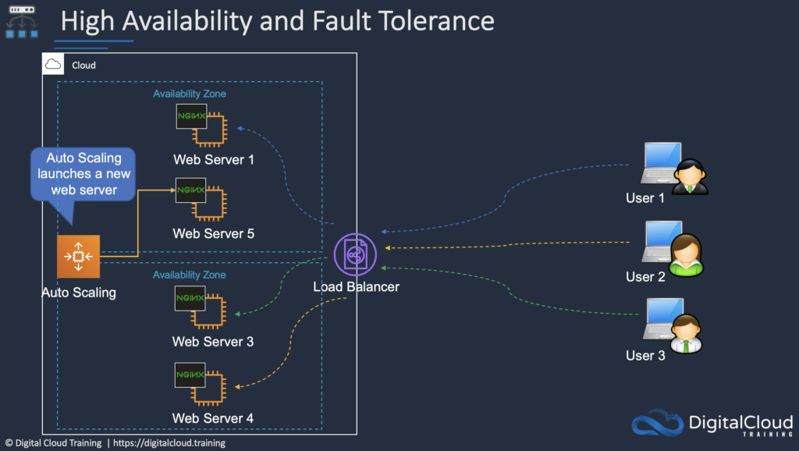
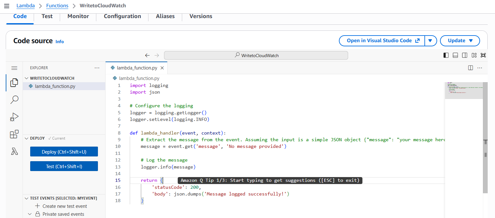
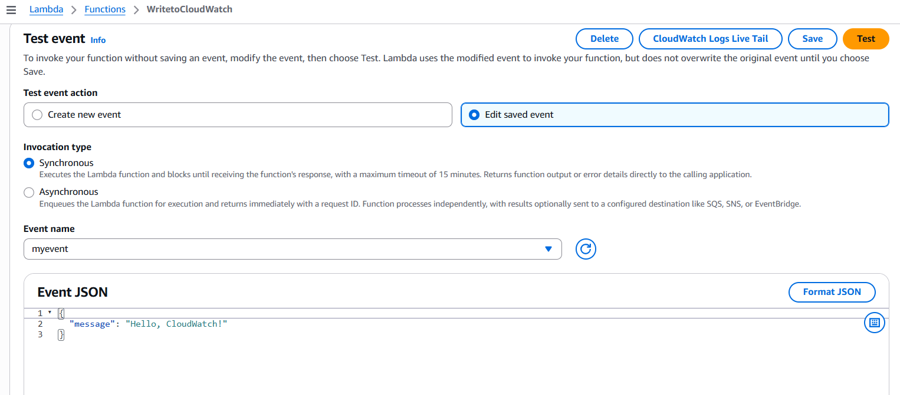
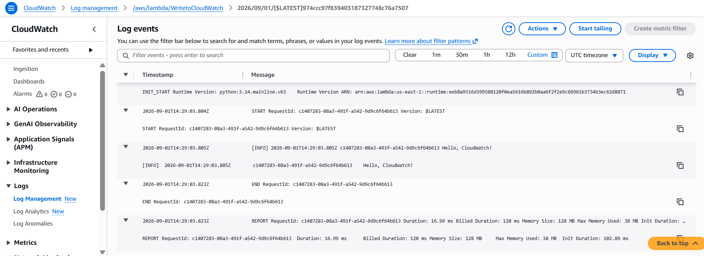

## Task 3: Networking, Scaling & Application Services

### Domain Name System (DNS):
- Used to direct traffic to resources
- When searching for a domain (eg:amazon.com), DNS finds the IP address of the domain to connect to the domain's web server. 
- Amazon Route 53 is a DNS Service 
- Amazon Route 53 also provides health checks for EC2 instances, load balances etc.
- Can register a domain using Route 53 -
    1. Search for Route 53 on Console, Go to domain registration
    2. Register domain with a name (eg: training.link - .link is the cheapest option) -> Select -> Proceed to checkout -> can turn off auto-renew
    3. Fill out contanct info
    4. If request fails, follow link in message for support
    5. After, go to hosted zones to find your registered domain.  

### Scaling Up Vs Scaling Out:
Scaling Up -
- Add more hardware resources to a virtual machine or instance 
- Eg: Can change instance size from t2.micro to c5.large for more memory and cpu
- When storing states about the user like in a dynamic website, scaling up is better

Scaling Out -
- Add more instances (resources + operating system + web service) for the application
- load balance between them
- static website - easier to scale out
- Will not lose data or server because of multiple instances 

### Amazon E2 Auto Scaling:
- Can automatically launch and terminate EC2 instances based on demand
- Maintain availability if instance fails
- Works with - 
    - CloudWatch service to monitor whether application needs scaling up or scaling out
    - Elastic load balancing to distribute connections
    - E2 spot instances for cost 
    - VPC to deploy instances accross different avalability zones
- Cloud watch checks metrics and can launch new instances if uses more than 80% cpu
- Terminate instance when we don't need it
- Types are manual, dynamic, schedule
- Can adjust scaling policies based on preferences such as changing target metrics, scaling adjustments or schedule scaling for high demand times
- Launch templates definies what runs when auto scaling group scales.
- How to create Auto scaling group for EC2 instances:
    1. Use user data web server as launch template so pages will be different for different availability zones. 
    2. Launch templates in EC2 Console
    3. Create Launch templates for auto scaling with name, AMI, instance type, existing security group as WebAccess, add user data in advanced details -> Launch template
    4. Go to Auto scaling groups -> Create group with name and select launch template -> Choose availability zones -> Choose scaling options (min, max)

### Load Balancer:
- Used to distribute connections to the instances/other targets
- If an instance fails, load balancer will direct user connection to another working instance
- Manages network traffic by connecting user to available instance or web server
- Does Health checks to ensure instances are running properly 

Types of load balances: 
- Application Load Balancer - 
    - Operates at request level
    - Rotuing based on path url
    - Has http or https listeners
    - USE CASES: Web application, docker contianers, lambda targets
- Network Load Balancer - 
    - Operates at connection level
    - Routing based on IP protocols. Eg: TCP,TLS,UDP
    - Offers high performance, low latency
    - USE CASES: TCP and UDP based applications, very low latency, static IP addresses
- Gateway Load Balancer - 
    - Used infront of virtual appliances such as firewalls, intrusion dectection systems
    - Uses Geneve protocol
    - USE CASES: Deploy and manage 3rd party virtual appliances, centralised inspection, firewalls, cybersecurity

How to create Application Load balancer:
1. Go to EC2 Console and create Auto scaling group for 2 EC2 instances in 2 availabily zones (AZ)
2. Go to Load balancing -> Create Target groups -> Select target type as instances and add a name -> Choose HTTP as protocol -> Create target group
3. Go to Load balancers -> Create Load balancer for Application Load balancer with a name -> Choose the 2 AZ for mapping -> Select webaccess as security groups -> Select target group created under listeners and routing -> Create load balancer
4. Go to the Auto scaling group, edit load balancing -> select application, network, gateway target groups and select the target group -> update
5. Copy DNS name in load balancer and paste in browser to test

### Application Services:
Serverless services -
- No need to manage instances, provide hardware or manage OS
- Automatically manages capacity provisioning and patching
- Automatic scaling and cheaper
- Use with event driven architecture which is a pattern where an event would trigger an action in another service 
- Can build static website without server
- Eg: AWS Lambda Service

AWS Lambda -
- Run some code when triggered by an event
- Cost is based on memory assigned and the duration of func execution
- IAM role grants func permission to access other AWS services
- CloudWatch handles monitoring and logging
- Must add permissions to AWS Lambda if you want func code to connect to other AWS services

### Create/test a basic Lambda function:
Create a basic Lambda function that logs a message to Amazon CloudWatch logs -
1. Open working-with-lambda.md file and Copy the python code to run when event is triggered (import logging....) 
2. Search for Lambda in the Console -> Create a function -> Author from scratch -> Add function name -> Choose runtime as python -> Create function
3. Scroll down to Code source, Paste python code copied to log message into CloudWatch -> Click Deploy
4. Change tab from code source to configuration with default config for time and memory -> Click permission tab which has CloudWatch logs by default. Can edit execution role to add permissions to other AWS services.
5. Change to Test tab -> Copy first test event in working-with-lambda.md file -> Go back to test tab and add an event name -> Paste test event into event JSON -> Click save -> Click Test to Run
6. Change to Monitor tab -> Click view CloudWatch logs -> Select log stream
7. To Test event using the CLI, Go to CloudShell in Console -> Create a file in CloudShell named "payload.json" by running: nano payload.json -> Copy json test code from working-with-lambda.md file and paste in CloudShell -> save file -> Run Point 5 command from working-with-lambda.md file  in CloudShell but update <function-name> part with the lambda function name -> Can view test in CloudWatch logs 

How to create an event notification for S3 uploads:
1. Copy python code (line 54 to line 78) from working-with-lambda.md file 
2. Go back to the Lambda function's Code source tab and paste new code to log new objects uploaded into s3 bucket -> Deploy 
3. Go to Configuration tab -> Permissions -> Click Role name -> Add permissions under permisssions policies -> Search for S3 and select S3ReadOnlyAccess -> Add permission
4. Go back to lambda func -> Add trigger -> Chose S3 as source -> Choose a bucket/ create new bucket 
5. View S3 uploads in CloudWatch logs

### Lambda practice evidence:
Labdma Function Code Source:

Test event to log message into CloudWatch logs:

Message logged in CloudWatch logs:

### Application Integration Services:
- Simple Queue Service (SQS) - puts messages/orders into a queue, useful during high demand times 
- Simple Notification Service (SQS) - information sent to users when a new message is added into the topic queue, supports notifications to web application, email, sms
- Step Functions - useful for coordinating aws services with workflows
- Amazon MQ - similar to sqs, messages support apache, active mq, rabbitmq
- Event bridge - serverless event bus to connect application and aws services, event source changes and notifies event bus which has a rule to do or send a message to a target

### Understand API Gateway:
- Useful service to connect an application to different microservices
- Takes requests from application through rest api oven https
- Focuses on http methods to direct to different microservices 

